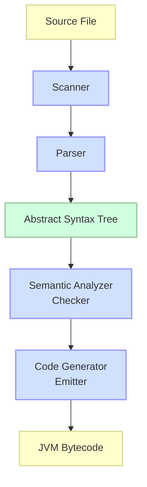
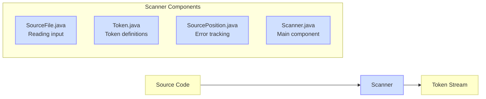
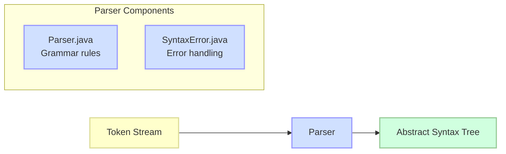
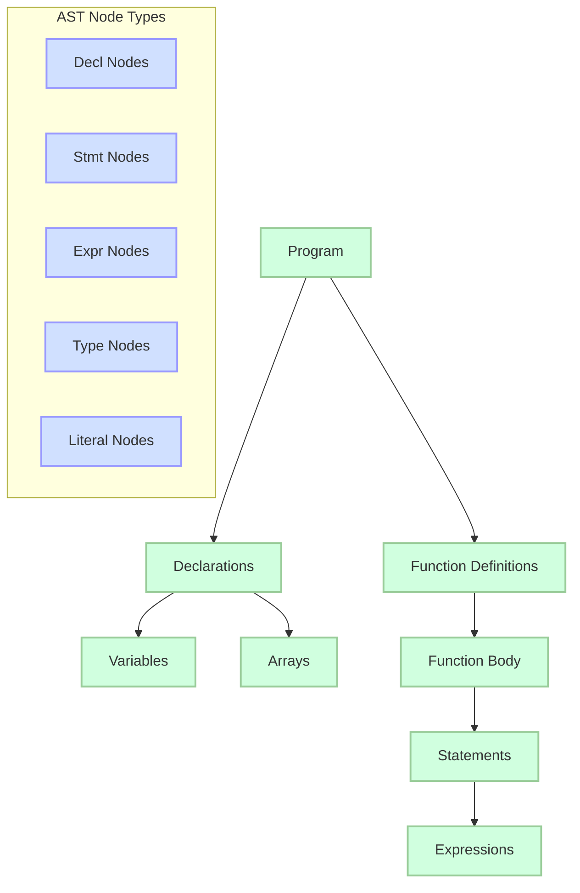
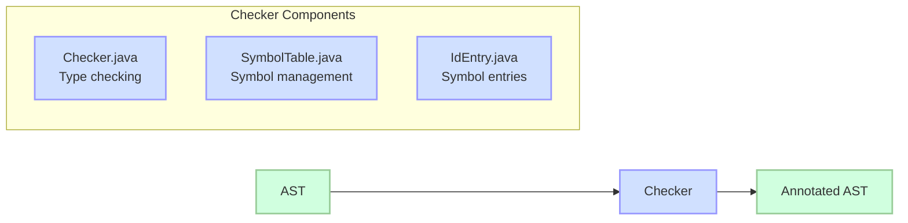
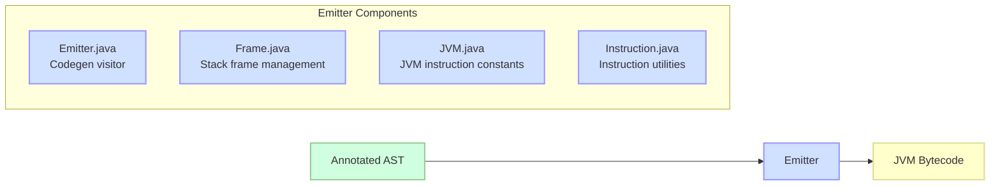
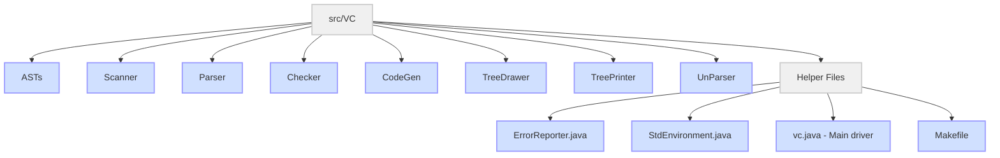
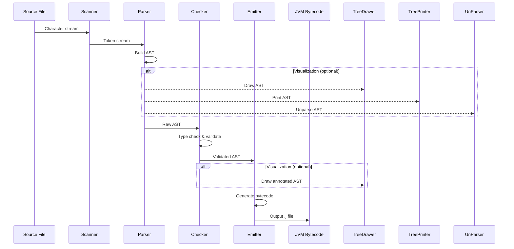
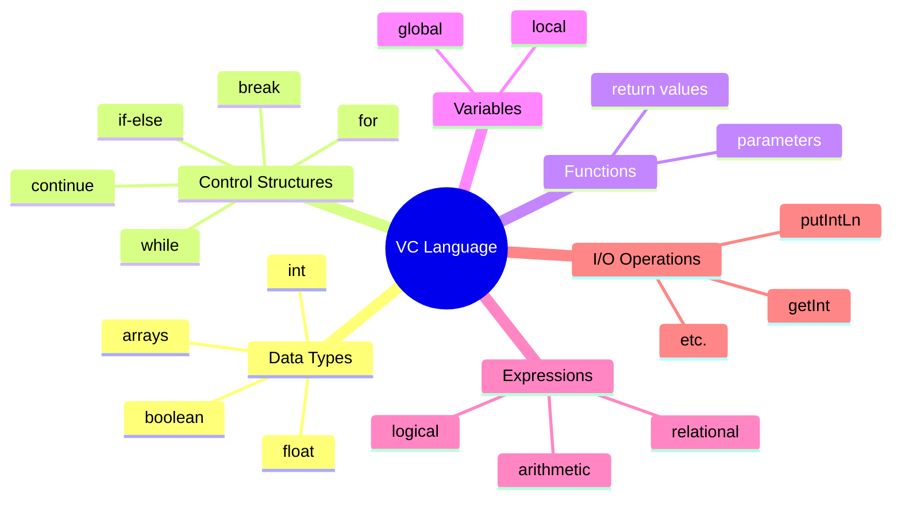

# VC Compiler

A compiler for the VC programming language that translates VC code into JVM bytecode.

## System Architecture



## Design Philosophy and Principles

The VC Compiler is designed based on the following principles:

1. **Modular Architecture**: The compiler is structured into distinct phases (lexical analysis, syntax analysis, semantic analysis, and code generation) that operate independently but sequentially.

2. **Abstract Syntax Tree (AST) Centrality**: The AST serves as the central data structure that gets built, analyzed, and traversed throughout the compilation process.

3. **Separation of Concerns**: Each component has well-defined responsibilities:
   - Scanner: Tokenizes the input source code
   - Parser: Performs syntax analysis and builds the AST
   - Checker: Performs semantic analysis on the AST
   - Emitter: Generates JVM bytecode from the checked AST

4. **Extensibility**: The design allows for additions to the language features by modifying the appropriate components.

5. **Error Reporting**: A uniform error reporting mechanism is used throughout the compilation process to provide meaningful feedback.

## Component Details

### 1. Scanner (Lexical Analyzer)



The Scanner component performs lexical analysis, converting the source code text into a sequence of tokens. It handles:

- Breaking down source code into meaningful tokens (identifiers, keywords, operators, etc.)
- Identifying and skipping whitespace and comments
- Managing source positions for accurate error reporting
- Supporting character escape sequences in string literals
- Detecting literal values (integers, floats, booleans, strings)

Key files include:
- **Scanner.java**: Main lexical analyzer that implements token extraction logic
- **Token.java**: Defines token types and their properties
- **SourceFile.java**: Handles reading from the source file
- **SourcePosition.java**: Tracks line and character positions for error reporting

### 2. Parser (Syntax Analyzer)



The Parser component analyzes the syntactic structure of the program, building an Abstract Syntax Tree (AST) representation. It handles:

- Implementing the context-free grammar of the VC language
- Creating appropriate AST nodes for declarations, statements, and expressions
- Handling expressions with appropriate operator precedence
- Detecting and reporting syntax errors
- Supporting array declarations and initializations

Key files include:
- **Parser.java**: Implements the parsing algorithms and grammar rules
- **SyntaxError.java**: Defines syntax error handling

### 3. Abstract Syntax Tree (AST)



The AST represents the hierarchical structure of the program. Key components include:

- **Base AST Classes**: Abstract classes defining the structure of the syntax tree
- **Declaration Nodes**: Represent variable and function declarations
- **Statement Nodes**: Represent control flow statements (if, while, for, return, etc.)
- **Expression Nodes**: Represent operations and value computations
- **Type Nodes**: Represent data types (int, float, boolean, arrays)
- **Visitor Pattern**: Enables traversal of the AST for semantic analysis and code generation

Key files include over 50 class files in the `ASTs` directory, each representing a specific node type in the syntax tree.

### 4. Semantic Analyzer (Checker)



The Semantic Analyzer (Checker) performs semantic validation of the program. It handles:

- Type checking for expressions and statements
- Symbol table management for variable and function declarations
- Scope handling for local/global variables
- Function call validation (parameter count and types)
- Array access verification
- Control flow validation (break/continue within loops)
- Return statement validation

Key files include:
- **Checker.java**: Implements the visitor pattern to traverse and validate the AST
- **SymbolTable.java**: Manages symbol tables for variable and function lookups
- **IdEntry.java**: Represents entries in the symbol table

### 5. Code Generator (Emitter)



The Code Generator (Emitter) translates the validated AST into JVM bytecode. It handles:

- Generating JVM instructions for expressions, statements, and declarations
- Managing stack frames for function calls
- Optimizing code generation for arithmetic expressions
- Handling static initialization for global variables
- Supporting array operations and access
- Control flow translation (if, while, for, break, continue)
- Function call and return mechanism

Key files include:
- **Emitter.java**: Implements the visitor pattern to traverse the AST and generate code
- **Frame.java**: Manages stack frames and local variable allocations
- **JVM.java**: Contains constants for JVM instructions
- **Instruction.java**: Utilities for instruction generation

## Project Structure



The directory structure of the VC compiler project:

```
VC_CodeGen/
├── src/
│   └── VC/
│       ├── ASTs/            # Abstract Syntax Tree definitions
│       ├── Checker/         # Semantic analysis
│       ├── CodeGen/         # Code generation components
│       │   ├── Emitter.java # Generates JVM bytecode
│       │   ├── Frame.java   # Stack frame handling
│       │   ├── JVM.java     # JVM instruction constants
│       │   └── *.vc         # Example VC programs
│       ├── Parser/          # Syntax analyzer
│       ├── Scanner/         # Lexical analyzer
│       ├── TreeDrawer/      # AST visualization tools
│       ├── TreePrinter/     # AST printing utilities
│       ├── UnParser/        # Converts AST back to source code
│       ├── ErrorReporter.java # Error handling
│       ├── Makefile         # Build system
│       ├── StdEnvironment.java # Standard environment definitions
│       └── vc.java          # Main compiler driver
```

### Key Components

- **Scanner**: Tokenizes the source code into lexical tokens.
- **Parser**: Builds an AST from the token stream provided by the scanner.
- **Checker**: Performs semantic analysis on the AST, including type checking.
- **Emitter**: Generates JVM bytecode from the semantically checked AST.
- **TreeDrawer/TreePrinter**: Visualization tools for debugging and understanding the AST.
- **UnParser**: Converts the AST back to source code, useful for validation.

## Compilation Process Flow



## Setup and Installation

### Prerequisites

- Java Development Kit (JDK) 8 or higher
- Make (for building with the provided Makefile)

### Building the Compiler

1. Clone the repository:
   ```
   git clone <repository-url>
   cd VC_CodeGen
   ```

2. Navigate to the VC directory:
   ```
   cd src/VC
   ```

3. Compile the compiler:
   ```
   make
   ```

## Usage

### Compiling a VC Program

To compile a VC program:

```
make run ARGS="path/to/your/program.vc"
```

Or use the Java command directly:

```
java VC.vc path/to/your/program.vc
```

### Command Line Options

The VC compiler supports several command-line options:

- `-d [1234]`: Display the AST with different levels of detail:
  - `1`: AST from the parser (without SourcePosition)
  - `2`: AST from the parser (with SourcePosition)
  - `3`: AST from the checker (without SourcePosition)
  - `4`: AST from the checker (with SourcePosition)
  
- `-t [file]`: Print the (non-annotated) AST into a file
  
- `-u [file]`: Unparse the (non-annotated) AST into a file

### Running Test Cases

To run all test cases in a module:

```
make test MODULE=CodeGen
```

To compare outputs with expected solutions:

```
make diff MODULE=CodeGen
```

## Example VC Programs

### Greatest Common Divisor (GCD)

```c
int i;
int j;
// find the maximum of two integers
int gcd(int a, int b) {
  if (b == 0) 
    return a;
  else
  return gcd(b, a - (a/b) *b);
}
int main() {  
  i = getInt();
  j = getInt();
  putIntLn(gcd(i, j));
  return 0;
}
```

### Maximum of Two Numbers

```c
int i;
int j;
int max;
// find the maximum of two integers
int main() {  
  i = getInt();
  j = getInt();
  if (i > j) 
    max = i;
  else
    max = j;
  putIntLn(max);
  return 0;
}
```

## VC Language Features



The VC language is a simplified C-like language that supports:

- Basic data types: int, float, boolean
- Variables and expressions
- Control structures: if-else, while, for
- Functions with parameters and return values
- I/O operations via built-in functions (getInt, putIntLn, etc.)

## Compilation Process

1. **Lexical Analysis**: The Scanner breaks down the source code into tokens.
2. **Syntax Analysis**: The Parser builds an AST from the token stream.
3. **Semantic Analysis**: The Checker performs type checking and other semantic validations.
4. **Code Generation**: The Emitter translates the AST into JVM bytecode.

The output is a `.j` file containing Jasmin assembly code, which can be assembled into a `.class` file for execution on the JVM.

## Debugging Tools

The VC compiler provides several tools for debugging:

- AST visualization using the TreeDrawer
- AST printing using the TreePrinter
- Source code regeneration using the UnParser

## License

[Add license information here]

## Credits

The VC compiler was developed by Jingling Xue, CSE, UNSW, Sydney NSW 2052, Australia. 